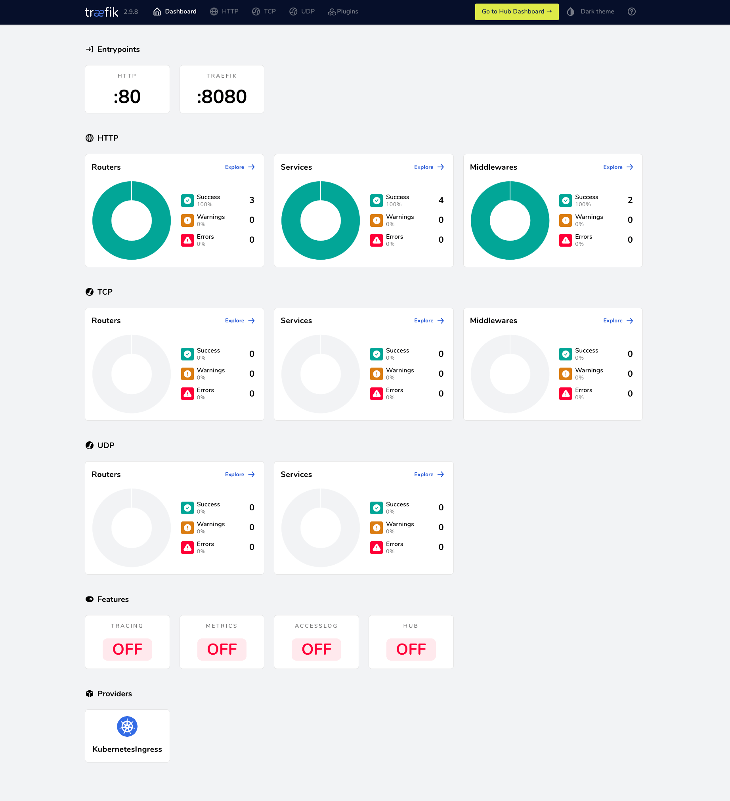

# Launch Traefik Proxy in a Kubernetes cluster with Proxy Wizard

To run Traefik Proxy in a Kubernetes cluster you need to create a handful of
[resources files](https://doc.traefik.io/traefik/getting-started/quick-start-with-kubernetes/)
to grant Traefik access to your cluster and configure it to act as a reverse proxy
to your application.

Instead of doing all of that manually, with Proxy Wizard you can do it in one single script.

## Install Traefik Proxy

1. Open the terminal in your cluster's directory where you wish
to add Traefik's resource files.
1. If you are on Minikube, run `minikube start`.
1. Run:

```shell
curl -s https://raw.githubusercontent.com/VirtuaCreative/traefik-wizard/main/traefik-proxy-install.sh > ./traefik-proxy-install.sh
sh traefik-proxy-install.sh
```

The script:

- Copies the example [resource files](../proxy-kube-resources/) from this project to a directory called
`traefik` on your computer.
- Deploys the Traefik Proxy Dashboard on port 8080.
- Deploys and an example application [`hello-world`](https://github.com/VirtuaCreative/html-hello-world)
behind Traefik as reverse proxy on port 80.

## Launch the Traefik Proxy Dashboard

To launch the Traefik Proxy Dashboard:

- If you are on Minikube, run `minikube service traefik-dashboard-service` to start the Dashboard service.
- Otherwise, visit [`http://localhost:8080`](http://localhost:8080).



## Launch the Hello World application

To preview your `hello-world` application:

- If you are on Minikube, run `minikube service hello-world` to start the application service.
- Otherwise, run  `curl -v http://localhost/` to access application.

## Modify the example resources

Once you have all set, you can delete the `traefik-proxy-install.sh` file as you no longer need it.
You can modify the resource files according to your needs and deploy your own application.

Check the [Traefik Proxy documentation](https://doc.traefik.io/traefik/) for further details.

## Publish your application

You can use [Traefik Hub](https://doc.traefik.io/traefik-hub/) to publish your Kubernetes application to the
web with no hassle. It's fast and no credit card required (so far).

## Assets

The assets used for the Hello World application are:

- [GH repo](https://github.com/VirtuaCreative/html-hello-world): the application itself.
- [Docker image](https://hub.docker.com/r/ramosmd/html-hello-world): the Docker image of the application.
